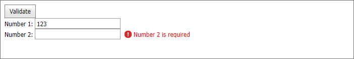

<!-- default badges list -->

<!-- default badges end -->
# ASP.NET Web Forms Editors - How to validate editors in a container on the server
<!-- run online -->
**[[Run Online]](https://codecentral.devexpress.com/e3633/)**
<!-- run online end -->

This example demonstrates how to validate visible [DevExpress Data Editors](https://docs.devexpress.com/AspNet/7897/components/data-editors) in a container.

Pass a container to the [ASPxEdit.ValidateEditorsInContainer](https://docs.devexpress.com/AspNet/DevExpress.Web.ASPxEdit.ValidateEditorsInContainer(System.Web.UI.Control)) method to validate visible editors in this container. To check whether all editors are valid, call the [ASPxEdit.AreEditorsValid](https://docs.devexpress.com/AspNet/devexpress.web.aspxedit.areeditorsvalid.overloads) or [ASPxClientEdit.AreEditorsValid](https://docs.devexpress.com/AspNet/js-ASPxClientEdit.AreEditorsValid.static) method. 

## Files to Review

* [Default.aspx](./CS/WebSite/Default.aspx) (VB: [Default.aspx](./VB/WebSite/Default.aspx))
* [Default.aspx.cs](./CS/WebSite/Default.aspx.cs) (VB: [Default.aspx.vb](./VB/WebSite/Default.aspx.vb))

## Documentation

* [Data Editors - Validation](https://docs.devexpress.com/AspNet/11167/components/data-editors/common-concepts/validation)

## More Examples

* [ASP.NET Web Forms Editors - How to check the validation state of editors](https://github.com/DevExpress-Examples/how-to-check-the-validation-state-of-editors-using-the-areeditorsvalid-method-e1844)
* [ASP.NET Web Forms Editors - How to raise validation on the client](https://github.com/DevExpress-Examples/asp-net-web-forms-editors-client-side-validation)
